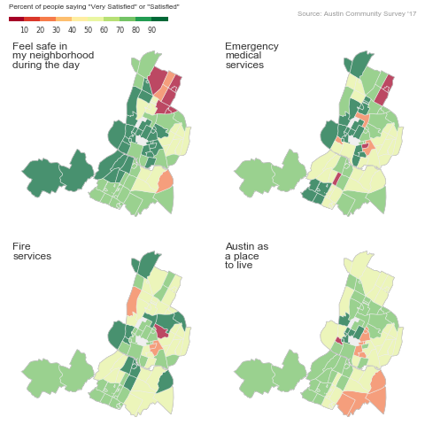

# Austin Community Survey - Mapped

***Note!*** This is 100%, authentically, and eagerly ripped off from The Upshot's article [The The Best and Worst New York Neighborhoods for Subway Service, Rat Control and 42 Other Joys of Urban Life](https://www.nytimes.com/interactive/2017/06/30/upshot/the-best-and-worst-new-york-neighborhoods.html). 

I've recreated a rough approximation using Python instead of JavaScript; specifically I used the Pandas, GeoPandas, and Matplotlib libraries. Survey and GIS data to create the maps is sourced from Austin's open data portal.

[Notebook here](01-austin-neighborhoods.ipynb)

